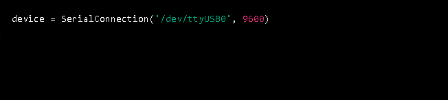
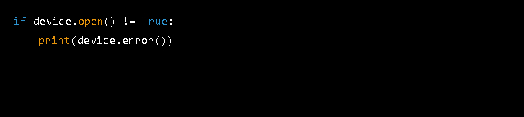
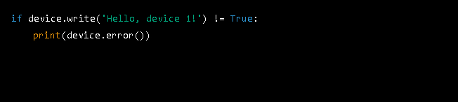
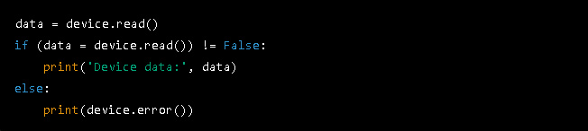
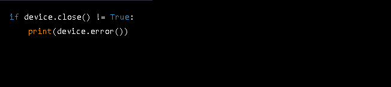

<h1 align="center">Serial Connection</h1>

'<b>SerialConnection</b>' is a Python class for serial communication, which provides a simple interface for reading and writing data to a serial port. The class is designed to be easy to use and can be customized for different baud rates and ports.

The class provides four methods: '<b>open()</b>', '<b>read()</b>', '<b>write()</b>', and '<b>close()</b>', which correspond to the basic operations of opening a serial port, reading data from it, writing data to it, and closing the connection.

The class also includes an error method that returns any error messages generated during the operation of the class. The error messages can be used to diagnose and fix issues during serial communication.

The code is compatible with both Windows and Linux, making it a useful tool for anyone working with serial devices.

Use this code to quickly and easily integrate serial communication into your Python project.

<h2>Installation</h2>

To use this library, you must have Python 3.6 or later installed on your system. You can <a href="https://www.python.org/downloads/" target="_blank">download</a> Python from the official website.

You can install the pyserial module, which is used by this library, using pip. Open a terminal or command prompt and type:

Copy code

pip install pyserial

Once you have Python and pyserial installed, you can use this library in your Python projects.

<h2>Usage</h2>

<table>
	<tr>
    	<td>1. Import the '<b>SerialConnection</b>' class:
&nbsp;
</td>
	</tr>	  
	<tr>
    	<td></td>
	</tr>	  
	<tr>
		<td>
&nbsp;

2. Create a new instance of '<b>SerialConnection</b>' by passing the port and baudrate as parameters: 

&nbsp;
</td>
	</tr>	  
	<tr>
    	<td></td>
	</tr>	  
	<tr>
    	<td>
&nbsp;

3. Open the serial port:

&nbsp;
</td>
	</tr>	  
	<tr>
    	<td></td>
	</tr>	  
	<tr>
    	<td>
&nbsp;

4. Write data to the serial port:

&nbsp;
</td>
	</tr>	  
	<tr>
    	<td></td>
	</tr>	  
	<tr>
    	<td>
&nbsp;

5. Read data from the serial port:

&nbsp;
</td>
	</tr>	
	<tr>
    	<td></td>
	</tr>	
	<tr>
    	<td>
&nbsp;

6. Close the serial port:

&nbsp;
</td>
	</tr>	
	<tr>
    	<td></td>
	</tr>	
	<tr>
    	<td>
&nbsp;

Note: '<b>device.error()</b>' returns a string with the last error message.

&nbsp;
</td>
	</tr>
</table>

<h2>Contributions</h2>

If you find any bugs or issues with '<b>SerialConnection</b>', please feel free to report them by opening an issue on this repository.

<h2>License</h2>

This project is licensed under the MIT License. See the LICENSE.md file for more information.

<h2>Connect with me:</h2>

If you have any questions, feedback or just want to connect, feel free to reach out to me on LinkedIn.

